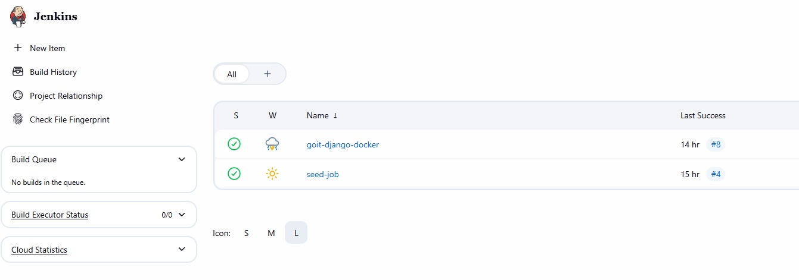
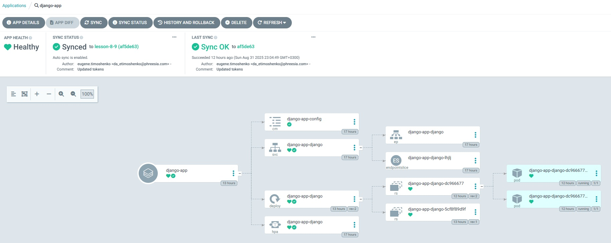
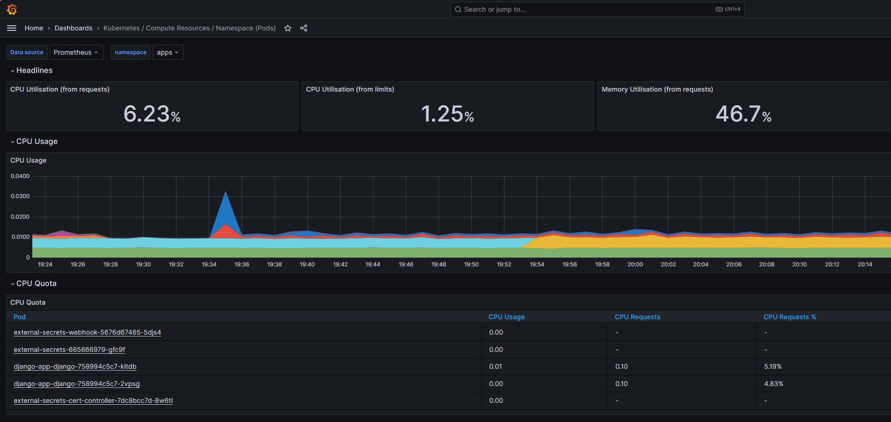

# «Фінальний інфраструктурний проєкт на Terraform та Kubernetes (EKS)»

Конфігурація Terraform з набором модулей для підготовки інфраструктури на AWS та розгортання Django застосунку.

- **S3** бакет і **DynamoDB** таблиця для remote backend стану Terraform.
- Базова **VPC** з публічними та приватними підмережами і маршрутизацією.
- **ECR** репозиторій з авто-скануванням образів та політикою доступу.
- **EKS** кластер з нод группою, IAM ролями та необхідними аддонами
- **RDS** зовнішня база даних (RDS\Aurora)
- **Monitoring** Система моніторинга (Prometheus + Grafana)
- **Jenkins** CI/CD сервер, seed-job, інтеграція з GitHub
- **Argo CD** GitOps інструмент для відстежування конфігурації в репозиторії та автоматичного оновлення додатку
- **Helm-чарт** Django-застосунку

### Структура проєкту

```
final-project/
│
├── apps-stack              # Тераформ стек для CI/CD інфраструктури (Jenkins, Argo CD, Prometheus, Grafana)
│   ├── main.tf             # Головний файл для підключення модулів
│   ├── backend.tf          # Налаштування бекенду для стейтів (S3 + DynamoDB)
│   ├── outputs.tf          # Загальні виводи ресурсів
│   ├── variables.tf        # Загальні змінні
│
├── infra-stack             # Тераформ стек для створення базової інфраструктури (VPC, S3, ECR, RDS, EKS)
│   ├── main.tf
│   ├── backend.tf
│   ├── outputs.tf
│   ├── variables.tf
│
├── modules/                 # Каталог з усіма модулями
│   ├── s3-backend/          # Модуль для S3 та DynamoDB
│   │   ├── s3.tf            # Створення S3-бакета
│   │   ├── dynamodb.tf      # Створення DynamoDB
│   │   ├── variables.tf     # Змінні для S3
│   │   └── outputs.tf       # Виведення інформації про S3 та DynamoDB
│   │
│   ├── vpc/                 # Модуль для VPC
│   │   ├── vpc.tf           # Створення VPC, підмереж, Internet Gateway
│   │   ├── routes.tf        # Налаштування маршрутизації
│   │   ├── variables.tf     # Змінні для VPC
│   │   └── outputs.tf
|   |
│   ├── ecr/                 # Модуль для ECR
│   │   ├── ecr.tf           # Створення ECR репозиторію
│   │   ├── variables.tf     # Змінні для ECR
│   │   └── outputs.tf       # Виведення URL репозиторію
│   │
│   ├── k8s-baseline/        # Модуль для налаштування Kubernetis кластера
│   │   ├── storageclass.tf  # Створення gp3 StorageClass
|   |   └── versiones.tf
|   |
│   ├── k8s-external-secrets  # Модуль інтеграції з External Secrets Operator
│   │   ├── manifests.tf      # Опис ClusterSecretStore та ExternalSecret для RDS параметрів
|   |   └── providers.tf
|   |   └── variables.tf
|   |
│   ├── eks/                 # Модуль для Kubernetes кластера
│   │   ├── eks.tf           # Створення кластера
|   |   ├── eso.tf           # Налаштування External Secrets для EKS
|   |   ├── nodes.tf         # Группа вокер-нодів та IAM-ролі для неї
|   |   ├── addons.tf        # Додатки для EKS
│   │   ├── variables.tf     # Змінні для EKS
│   │   └── outputs.tf       # Виведення інформації про кластер
│   │
│   ├── rds/                 # Модуль для RDS
│   │   ├── rds.tf           # Створення RDS бази даних
│   │   ├── aurora.tf        # Створення aurora кластера бази даних
│   │   ├── shared.tf        # Спільні ресурси
│   │   ├── variables.tf     # Змінні (ресурси, креденшели, values)
│   │   └── outputs.tf
│   │
│   ├── jenkins/             # Модуль для Helm-установки Jenkins
│   │   ├── jenkins.tf       # Helm release для Jenkins
│   │   ├── variables.tf     # Змінні (ресурси, креденшели, values)
│   │   ├── providers.tf     # Оголошення провайдерів
│   │   ├── values.yaml      # Конфігурація jenkins
│   │   └── outputs.tf       # Виводи (URL, пароль адміністратора)
│   │
│   └── argo_cd/             # Mодуль для Helm-установки Argo CD
│       ├── jenkins.tf       # Helm release для Jenkins
│       ├── variables.tf     # Змінні (версія чарта, namespace, repo URL тощо)
│       ├── providers.tf     # Kubernetes+Helm.  переносимо з модуля jenkins
│       ├── values.yaml      # Кастомна конфігурація Argo CD
│       ├── outputs.tf       # Виводи (hostname, initial admin password)
│		    └──charts/               # Helm-чарт для створення app'ів
│ 	 	    ├── Chart.yaml
│	  	    ├── values.yaml
│			    └── templates/         # Список applications, repositories
│		        ├── application.yaml
│		        └── repository.yaml
│
├── charts/
│   └── django-app/
│       ├── templates/
│       │   ├── deployment.yaml
│       │   ├── service.yaml
│       │   ├── configmap.yaml
│       │   └── hpa.yaml
│       ├── Chart.yaml
│       └── values.yaml     # ConfigMap зі змінними середовища
│
└──Django/                  # Django застосунок
			 ├── goit/
			 ├── Dockerfile
			 ├── Jenkinsfile
             ├── requirements.txt
```

### Налаштування середовища і запуск розгортання інфраструктури

Інфраструктура розділена на два окремих Terraform-стеки:

- `infra-stack` — базова інфраструктура (мережа, безпека, RDS).
- `apps-stack` — застосунки у кластері EKS (Django-app, Helm-чарти, інтеграція з RDS).

Таке розділення дозволяє спростити керування залежностями: спочатку створюється база даних, після чого застосунок отримує її endpoint через зовнішні секрети.

**Передумови:**

- AWS CLI v2
- Облікові дані з правами на: S3, DynamoDB, VPC, Subnet, Internet Gateway, Route Table, ECR.

**Налаштування облікових даних (тимчасові STS-токени)**

Можна використати або змінні середовища PowerShell, або AWS CLI

**PowerShell:**

```
$env:AWS_ACCESS_KEY_ID     = <AWS_ACCESS_KEY>
$env:AWS_SECRET_ACCESS_KEY = <AWS_SECRET_KEY>

# (опційно) регіон
$env:AWS_REGION = "us-east-2"
```

#### Infra stack

**Bootstrapping бекенда (важливо)**

Якщо **S3 бакет** та **DynamoDB** таблиця для бекенда ще не існують:

1. Тимчасово закоментуйте блок `terraform` у `backend.tf` (або не підключайте файл).

2. Перейдіть в каталог `infra-stack`

3. Створіть ресурси локальним стейтом:

```
terraform init
terraform apply
```

4. Розкоментуйте блок `terraform` у `backend.tf` і мігруйте стейт:

```
terraform init -migrate-state
```

5. Далі працюйте як зазвичай (`plan/apply`) — тепер стейт зберігатиметься у S3 з блокуванням у DynamoDB.

Якщо бекенд уже існує — просто виконайте стандартні команди нижче.

#### App stack

1. Перейдіть в каталог `app-stack`

2. Створіть ресурси:

```
terraform init
terraform apply -var="github_user=<your_github_user>" -var="github_pat=<your_github_pat_key>"
```

#### Команди для запуску

1. Ініціалізація

```
terraform init
```

2. Перевірка плану змін

```
terraform plan
```

3. Застосування змін

```
terraform apply
```

Підтвердіть виконання, коли Terraform покаже план.

4. Знищення ресурсів

```
# Знищення всіх ресурсів
terraform destroy
```

### Опис модулів

#### s3-backend

- **Що створює:**

  - **S3** бакет для `terraform.tfstate` з версіонуванням та `BucketOwnerEnforced` ownership controls.
  - **DynamoDB** таблицю для блокування стейту.

- **Навіщо:** централізоване зберігання стейту і блокування для роботи в команді.
- **Ключові ресурси:** `aws_s3_bucket`, `aws_s3_bucket_versioning`, `aws_s3_bucket_ownership_controls`, `aws_dynamodb_table`.
- **Виводи:** `s3_bucket_name`, `dynamodb_table_name`.

#### vpc

- **Що створює:**

  - **VPC** з увімкненими DNS.
  - Набір **public** і **private** підмереж у вказаних **AZs**.
  - **Internet Gateway** для публічних підмереж.
  - **Route table** для виходу в інтернет + асоціації з public-subnets.

- **Навіщо:** базова мережева інфраструктура для розгортання ресурсів.
- **Ключові ресурси:** `aws_vpc`, `aws_subnet` (public/private), `aws_internet_gateway`, `aws_route_table`, `aws_route`, `aws_route_table_association`.
- **Виводи:** `vpc_id`, `public_subnets`, `private_subnets`, `internet_gateway_id`.

#### ecr

- **Що створює:**

  - **ECR repository** з `scan_on_push` та шифруванням (`AES256` або `KMS`).
  - **Repository policy**, яка дозволяє `push/pull` всередині вашого акаунту (Principal = `arn:aws:iam::<account_id>:root`).

- **Навіщо:** централізоване та кероване зберігання Docker/OCI-образів у межах AWS.
- **Ключові ресурси:** `aws_iam_policy_document`, `aws_ecr_repository`, `aws_ecr_repository_policy`.
- **Виводи:** `repository_url`, `repository_arn`, `repository_name`.

#### eks

- **Що створює:**

  - **IAM роль кластера** `(aws_iam_role.eks)` з trust-політикою для `eks.amazonaws.com` і прив’язкою політики `AmazonEKSClusterPolicy`.
  - **IAM роль вузлів** `(aws_iam_role.nodes)` з trust-політикою для `ec2.amazonaws.com` і прив’язками політик:
  - **AmazonEKSWorkerNodePolicy**
  - **AmazonEKS_CNI_Policy**
  - **AmazonEC2ContainerRegistryReadOnly**
  - **EKS кластер** `(aws_eks_cluster.eks)` з `access_config.authentication_mode = "API"` і `bootstrap_cluster_creator_admin_permissions = true`, з мережевою конфігурацією на заданих сабнетах.
  - **Managed Node Group** `(aws_eks_node_group.general)` з типом інстансів, масштабуванням і мітками вузлів.

  **Add-ons:**

  - **Amazon EBS CSI Driver** (`aws-ebs-csi-driver`) — керує EBS-томами для PVC/PV.
  - **EKS Pod Identity Agent** (`eks-pod-identity-agent`) — видача AWS-креденшіалів подам без OIDC/IRSA.
  - **metrics-server** — збір метрик CPU/Memory для kubectl top та HPA.

- **Навіщо:** керований Kubernetes-кластер на AWS з мінімально необхідними IAM-ролями/політиками та одним керованим пулом вузлів.
- **Ключові ресурси:** `aws_iam_role`, `aws_iam_role_policy_attachment`, `aws_eks_cluster`, `aws_eks_node_group`.
- **Виводи:** `repository_url`, `repository_arn`, `repository_name`

#### jenkins

- **Що створює:**

  - **Helm release Jenkins** у кластері EKS з використанням офіційного чарта.
  - **Namespace** для Jenkins.
  - **Values.yaml** з базовою конфігурацією.

- **Навіщо:** забезпечує централізований **CI/CD сервер** для:

  - побудови Docker-образів і пушу їх у ECR,
  - інтеграції з GitHub,
  - запуску pipeline (seed-job) для подальшого розгортання застосунків у Kubernetes.

- **Ключові ресурси:** `helm_release.jenkins`, `kubernetes_service_account.jenkins_sa`, `aws_iam_role.jenkins_kaniko_role`, `aws_iam_role_policy.jenkins_ecr_policy`.
- **Виводи:** Ім'я Jenkins релізу, ім'я Jenkins namespace.

#### argo_cd

- **Що створює:**

  - **Helm release Argo CD** у виділеному namespace.
  - **Values.yaml** з базовими налаштуваннями.
  - **Helm subchart** (charts/) для опису:
    - **Applications** (django-app),
    - **Repositories** (GitHub репозиторій).

- **Навіщо:** забезпечує **GitOps-підхід**:

  - відстежує зміни в GitHub-репозиторії (Helm-чарти/values),
  - автоматично застосовує зміни у кластері (Continuous Deployment).

- **Ключові ресурси:** `helm_release.argo_cd`, `helm_release.argo_apps`
- **Виводи:** ім'я сервісу Argo CD, пароль адміністратора.

#### rds

- **Що створює:**

  - **RDS/Aurora кластер** (PostgreSQL або Aurora PostgreSQL, залежно від параметра `use_aurora`).
  - **Базу даних** із вказаним ім’ям (`db_name`), користувачем (`username`) та паролем (`password`).
  - **DB інстанси** із заданим класом (`instance_class`) та кількістю (`aurora_instance_count` для Aurora).
  - **Parameter group** з користувацькими параметрами (`parameters`).
  - **Subnets** для розгортання (приватні або публічні).
  - **Налаштування бекапів та Multi-AZ** (резервування і відмовостійкість).

- **Навіщо:** забезпечує **зовнішню базу даних** для застосунків у Kubernetes/EKS чи інших сервісів:
  - відділяє зберігання даних від життєвого циклу застосунку,
  - підтримує масштабування (Aurora), високу доступність (Multi-AZ),
  - дозволяє централізовано керувати параметрами бази.

**Ключові ресурси:** `aws_db_instance`, `aws_rds_cluster`, `aws_rds_cluster_instance`, `aws_db_parameter_group`, `aws_rds_cluster_parameter_group`

**Виводи:** `rds_endpoint` (RDS або Aurora cluster endpoint) для підключення з додатку

#### monitoring

- **Що створює:**

  - **Namespace** для моніторингу (`monitoring` або вказаний у `var.namespace`).
  - **Prometheus + Grafana** через Helm Release з кастомними параметрами:
    - клас сховища (`storage_class`),
    - розмір сховища для Prometheus (`prometheus_storage_size`),
    - пароль адміністратора Grafana (`grafana_admin_password`),
    - період зберігання метрик (`retention_days`).
  - **ServiceMonitor для Jenkins** (якщо `enable_jenkins_monitoring = true`) — збирає метрики з Jenkins.
  - **ServiceMonitor для Argo CD** (якщо `enable_argocd_monitoring = true`) — збирає метрики з ArgoCD.

- **Навіщо:** забезпечує **централізовану систему моніторингу** у Kubernetes/EKS:
  - Prometheus збирає метрики з кластеру та сервісів,
  - Grafana надає візуалізацію та дашборди,
  - інтеграція з Jenkins і Argo CD дозволяє відслідковувати стан CI/CD процесів,
  - дає можливість централізовано зберігати історичні метрики для аналізу.

- **Ключові ресурси:** `kubernetes_namespace`, `helm_release` (Prometheus/Grafana), `kubernetes_manifest` (ServiceMonitor для Jenkins та ArgoCD)

**Виводи:** `grafana_service_name` (ім'я сервісу Grafana),

### Розгортання через Helm: PostgreSQL + Django + HPA

#### Передумови:

- **Кластер EKS створений Terraform (з add-ons: `aws-ebs-csi-driver`, `metrics-server`).**
- **Кластер RDS створений Terraform.**
- **`kubectl` та `helm` налаштовані на ваш кластер.**
- **Образ Django запушено в ECR.**

#### 1. Налаштування хоста бази даних

У файлі `\charts\django-app\values.yaml` задаємо значення змінної `POSTGRES_HOST` у секції config, яке ми отримали в якості виводу `rds_endpoint` з RDS модуля тераформ.

#### 2. Розгорнути кастомний Helm-чарт django-app

У цьому чарті:

- Service типу LoadBalancer для зовнішнього доступу
- HPA (autoscaling/v2) 2..6 реплік за CPU > 70%
- ConfigMap з env (включно з параметрами підключення до Postgres)

```
# з кореня проєкту
helm upgrade --install django-app ./charts/django-app -n apps -f ./charts/django-app/values.yaml

# очікуємо успішний rollout
kubectl rollout status deploy/django-app-django -n apps

# подивитись логи застосунку
kubectl logs deploy/django-app-django -n apps --tail=100
```

Якщо ви щойно запушили новий тег образу, передайте його через `--set image.tag=<tag>`.
Якщо лишили тег `latest`, примусьте пул: `--set image.pullPolicy=Always та kubectl rollout restart deploy/django-app-django`.

#### 4. Отримати публічний hostname застосунку

`kubectl get svc django-app-django -n apps -o jsonpath='{.status.loadBalancer.ingress[0].hostname}{"\n"}'`

Відкривайте у браузері:

`http://<ELB-hostname>/`

#### 5. Перевірка метрик (metrics-server) і HPA

Переконайтесь, що метрики присутні:

```
kubectl top nodes
kubectl top pods -n default
```

Перевіряємо HPA:

```
kubectl get hpa -n apps
kubectl describe hpa django-app-django -n apps
```

### Jenkins CI/CD

#### 1. Доступ до Jenkins
  - URL адресу можна отримати за допомогою команди.
    `kubectl -n jenkins get svc jenkins -o jsonpath='{.status.loadBalancer.ingress[0].hostname}'`

  - Адміністратор та його пароль задані через змінні `jenkins_admin_username` та `jenkins_admin_password`.

#### 2. Seed-job
  - Після входу у Jenkins ви побачите pipeline job, який створює `goit-django-docker` пайплайн
  - **goit-django-docker** пайплайн:
    - клонує GitHub-репозиторій,
    - будує Docker-образ,
    - пушить у ECR,
    - оновлює image.tag у файлі `charts/values.yaml`, що призводить до деплою **django-app** в Argo CD.



### Argo CD

#### 1. Доступ до Argo CD
- URL адресу можна отримати за допомогою команди.
  
  `kubectl -n argocd get svc -l app.kubernetes.io/name=argocd-server -o jsonpath='{.items[0].status.loadBalancer.ingress[0].ip}{.items[0].status.loadBalancer.ingress[0].hostname}'`

- Початковий пароль адміністратора можна отримати з секрету:

  `kubectl -n argocd get secret argocd-initial-admin-secret -o jsonpath='{.data.password}' | base64 -d`

Після входу додаток має мати статус Healthy:



#### 2. Репозиторії та застосунки
  - У `charts/templates/` описані ресурси:
    - application.yaml – конфіг для django-app,
    - repository.yaml – підключення GitHub репозиторію.

#### 3. GitOps-потік
  - Розробник пушить зміни у `charts/values.yaml`.
  - Argo CD синхронізує стан із кластером.
  - Автоматичне оновлення (self-heal) у випадку ручних змін у кластері.

### RDS

#### 1. Доступ до RDS

Enpoint буде доступний в output змінній `rds_endpoint` після виконання `terraform apply`.

`rds_endpoint = "django-db.ch6q86eac5ns.us-east-2.rds.amazonaws.com:5432"`

Приклад підключеня до бази даних:
```
psql --host=django_db.xxxxxxxxx.us-east-2.rds.amazonaws.com \
     --port=5432 \
     --username=django_user \
     --dbname=django_db
```

#### 2. Використання модуля

Змінна `use_aurora` контролює який саме кластер буде створено - RDS чи Aurora

### Моніторинг

#### 1. Доступ до Grafana

- URL адресу можна отримати за допомогою команди.
  
  `kubectl -n monitoring get svc prometheus-grafana -o jsonpath='{.status.loadBalancer.ingress[0].hostname}'`

- Пароль адміністратора заданий через змінну `grafana_admin_password`

Після входу перейдіть в Dashboards і відкрийте той який вам потрібен, наприклад **Kubernetes / Compute Resources / Namespace (Pods)**




