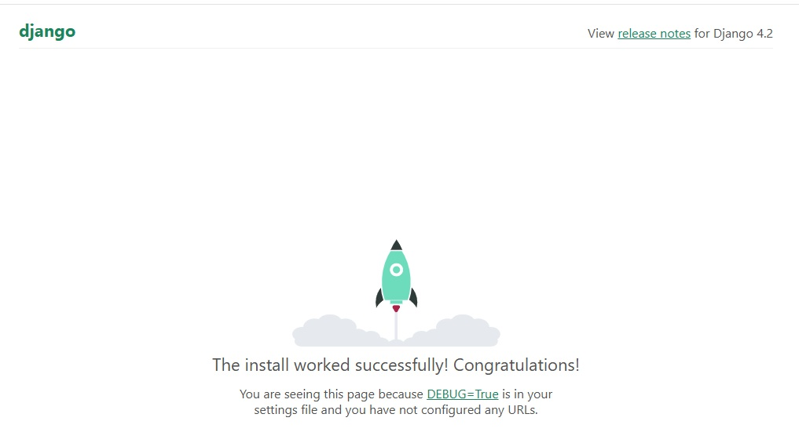

# Домашнє завдання до теми «Docker»

## Опис завдання

1. Створіть власний проєкт, що включає:
   - **Django** — для вебзастосунку.
   - **PostgreSQL** — для збереження даних.
   - **Nginx** — для обробки запитів.

2. Використайте Docker і Docker Compose для контейнеризації всіх сервісів.
3. Запуште проєкт у свій репозиторій на GitHub для перевірки

## Приклад роботи вебзастосунку



```
PS C:\GoIT\DevOps\goit-devops-hw\docker\django> docker-compose logs -f web
django  | Watching for file changes with StatReloader
django  | [10/Aug/2025 11:23:48] "GET / HTTP/1.0" 200 10731
django  | [10/Aug/2025 11:23:48] "GET /static/admin/css/fonts.css HTTP/1.0" 404 1811
django  | [10/Aug/2025 11:23:54] "GET / HTTP/1.0" 200 10731
django  | [10/Aug/2025 11:23:54] "GET /static/admin/css/fonts.css HTTP/1.0" 404 1811
```

```
PS C:\GoIT\DevOps\goit-devops-hw\docker\django> docker-compose logs -f nginx
nginx  | /docker-entrypoint.sh: /docker-entrypoint.d/ is not empty, will attempt to perform configuration
nginx  | /docker-entrypoint.sh: Looking for shell scripts in /docker-entrypoint.d/
nginx  | /docker-entrypoint.sh: Launching /docker-entrypoint.d/10-listen-on-ipv6-by-default.sh
nginx  | 10-listen-on-ipv6-by-default.sh: info: /etc/nginx/conf.d/default.conf is not a file or does not exist
nginx  | /docker-entrypoint.sh: Sourcing /docker-entrypoint.d/15-local-resolvers.envsh
nginx  | /docker-entrypoint.sh: Launching /docker-entrypoint.d/20-envsubst-on-templates.sh
nginx  | /docker-entrypoint.sh: Launching /docker-entrypoint.d/30-tune-worker-processes.sh
nginx  | /docker-entrypoint.sh: Configuration complete; ready for start up
nginx  | 2025/08/10 11:23:40 [notice] 1#1: using the "epoll" event method
nginx  | 2025/08/10 11:23:40 [notice] 1#1: nginx/1.29.0
nginx  | 2025/08/10 11:23:40 [notice] 1#1: built by gcc 12.2.0 (Debian 12.2.0-14+deb12u1)
nginx  | 2025/08/10 11:23:40 [notice] 1#1: OS: Linux 6.6.87.2-microsoft-standard-WSL2
nginx  | 2025/08/10 11:23:40 [notice] 1#1: getrlimit(RLIMIT_NOFILE): 1048576:1048576
nginx  | 2025/08/10 11:23:40 [notice] 1#1: start worker processes
nginx  | 2025/08/10 11:23:40 [notice] 1#1: start worker process 20
nginx  | 2025/08/10 11:23:40 [notice] 1#1: start worker process 21
nginx  | 2025/08/10 11:23:40 [notice] 1#1: start worker process 22
nginx  | 2025/08/10 11:23:40 [notice] 1#1: start worker process 23
nginx  | 2025/08/10 11:23:40 [notice] 1#1: start worker process 24
nginx  | 2025/08/10 11:23:40 [notice] 1#1: start worker process 25
nginx  | 2025/08/10 11:23:40 [notice] 1#1: start worker process 26
nginx  | 2025/08/10 11:23:40 [notice] 1#1: start worker process 27
nginx  | 2025/08/10 11:23:40 [notice] 1#1: start worker process 28
nginx  | 2025/08/10 11:23:40 [notice] 1#1: start worker process 29
nginx  | 2025/08/10 11:23:40 [notice] 1#1: start worker process 30
nginx  | 2025/08/10 11:23:40 [notice] 1#1: start worker process 31
nginx  | 2025/08/10 11:23:40 [notice] 1#1: start worker process 32
nginx  | 2025/08/10 11:23:40 [notice] 1#1: start worker process 33
nginx  | 2025/08/10 11:23:40 [notice] 1#1: start worker process 34
nginx  | 2025/08/10 11:23:40 [notice] 1#1: start worker process 35
nginx  | 192.168.143.2 - - [10/Aug/2025:11:23:48 +0000] "GET / HTTP/1.1" 200 10731 "-" "Mozilla/5.0 (Windows NT 10.0; Win64; x64) AppleWebKit/537.36 (KHTML, like Gecko) Chrome/138.0.0.0 Safari/537.36" "-"
nginx  | 192.168.143.2 - - [10/Aug/2025:11:23:48 +0000] "GET /static/admin/css/fonts.css HTTP/1.1" 404 1823 "http://localhost/" "Mozilla/5.0 (Windows NT 10.0; Win64; x64) AppleWebKit/537.36 (KHTML, like Gecko) Chrome/138.0.0.0 Safari/537.36" "-"
nginx  | 192.168.143.2 - - [10/Aug/2025:11:23:54 +0000] "GET / HTTP/1.1" 200 10731 "-" "Mozilla/5.0 (Windows NT 10.0; Win64; x64) AppleWebKit/537.36 (KHTML, like Gecko) Chrome/138.0.0.0 Safari/537.36" "-"
nginx  | 192.168.143.2 - - [10/Aug/2025:11:23:54 +0000] "GET /static/admin/css/fonts.css HTTP/1.1" 404 1823 "http://localhost/" "Mozilla/5.0 (Windows NT 10.0; Win64; x64) AppleWebKit/537.36 (KHTML, like Gecko) Chrome/138.0.0.0 Safari/537.36" "-"
```